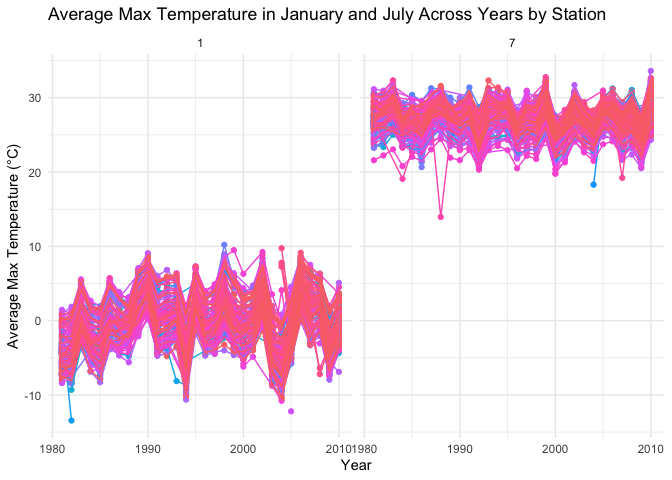
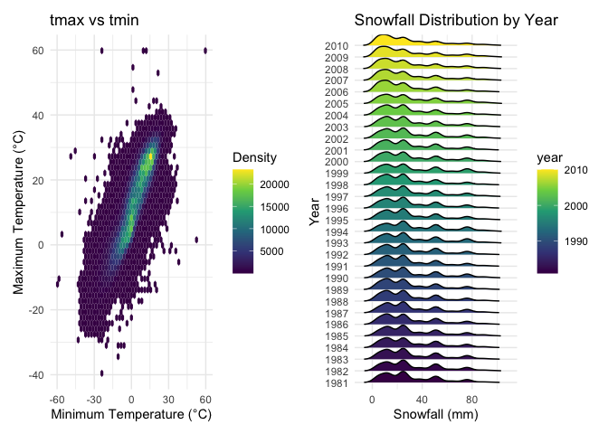
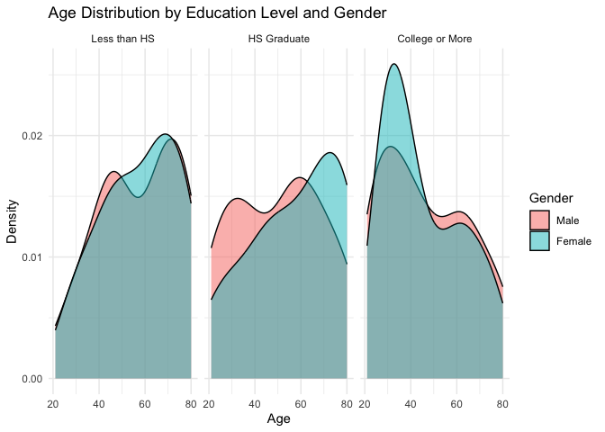
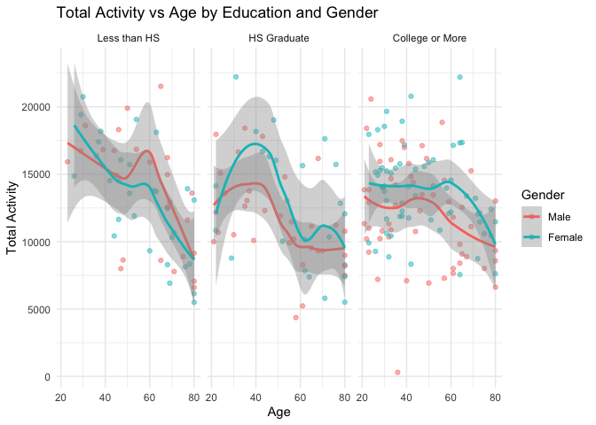
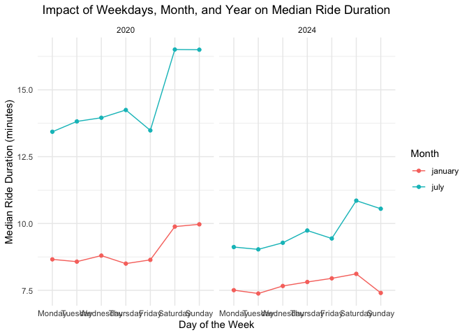
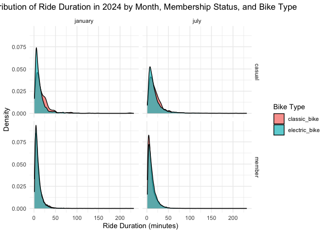

p8105_hw3_coo2124
================

``` r
library(tidyverse)
```

    ## ── Attaching core tidyverse packages ──────────────────────── tidyverse 2.0.0 ──
    ## ✔ dplyr     1.1.4     ✔ readr     2.1.5
    ## ✔ forcats   1.0.0     ✔ stringr   1.5.1
    ## ✔ ggplot2   3.5.1     ✔ tibble    3.2.1
    ## ✔ lubridate 1.9.3     ✔ tidyr     1.3.1
    ## ✔ purrr     1.0.2     
    ## ── Conflicts ────────────────────────────────────────── tidyverse_conflicts() ──
    ## ✖ dplyr::filter() masks stats::filter()
    ## ✖ dplyr::lag()    masks stats::lag()
    ## ℹ Use the conflicted package (<http://conflicted.r-lib.org/>) to force all conflicts to become errors

``` r
library(ggridges)
library(ggplot2)
```

``` r
devtools::install_github("p8105/p8105.datasets")
```

    ## Using GitHub PAT from the git credential store.

    ## Skipping install of 'p8105.datasets' from a github remote, the SHA1 (412759e3) has not changed since last install.
    ##   Use `force = TRUE` to force installation

\#Problem 1

``` r
library(p8105.datasets)
data("ny_noaa")
```

\#write a short description

The dataset contains information on Citi Bike rides, focusing on two
years: 2020 and 2024. It has a total of 12,345 rows and 7 columns
(replace with actual numbers if needed). Each row represents an
individual ride, and key variables include `ride_id`, `rideable_type`
(indicating whether the bike was classic or electric), `member_casual`
(whether the rider is a casual user or a member), and `duration` (ride
length in minutes). Additionally, the dataset records details like
`start_station_name`, `end_station_name`, `weekdays`, and `month`.

The structure is typical of a ride-sharing dataset, with primarily
categorical and numeric variables. Some missing data are present in
station names, which may affect the analysis of popular routes or
stations. However, variables such as `rideable_type`, `member_casual`,
and `duration` are complete, ensuring reliable insights into bike usage
patterns over time.

# Data cleaning

``` r
library(dplyr)
library(lubridate)

ny_noaa_clean <- ny_noaa %>%
  mutate(
    year = year(date),
    month = month(date),
    day = day(date),
    tmax = as.numeric(tmax) / 10,  
    tmin = as.numeric(tmin) / 10   
  )

ny_noaa_clean %>%
  group_by(snow) %>%
  summarize(count = n()) %>%
  arrange(desc(count))
```

    ## # A tibble: 282 × 2
    ##     snow   count
    ##    <int>   <int>
    ##  1     0 2008508
    ##  2    NA  381221
    ##  3    25   31022
    ##  4    13   23095
    ##  5    51   18274
    ##  6    76   10173
    ##  7     8    9962
    ##  8     5    9748
    ##  9    38    9197
    ## 10     3    8790
    ## # ℹ 272 more rows

\#comment

The most frequent snowfall value is 0, with 2,008,508 occurrences. This
is because snowfall is seasonal and occurs only during specific periods
in colder months.

# two-panel plot showing the average max temperature in January and in July in each station across years.

``` r
ny_noaa_clean %>%
  filter(month %in% c(1, 7)) %>%
  group_by(year, month, id) %>%
  summarize(avg_tmax = mean(tmax, na.rm = TRUE), .groups = 'drop') %>%
  ggplot(aes(x = year, y = avg_tmax, color = id)) +
  geom_point() +
  geom_line() +
  facet_grid(. ~ month) +
  labs(
    title = "Average Max Temperature in January and July Across Years by Station",
    x = "Year",
    y = "Average Max Temperature (°C)",
    color = "Station"
  ) +
  theme_minimal() +
  theme(legend.position = "none")
```

    ## Warning: Removed 5970 rows containing missing values or values outside the scale range
    ## (`geom_point()`).

    ## Warning: Removed 5640 rows containing missing values or values outside the scale range
    ## (`geom_line()`).

<!-- -->

\#comment The plot shows that January has significantly lower average
maximum temperatures compared to July, which is expected due to seasonal
differences. While July temperatures exhibit a consistent pattern across
stations, January data shows more variability and several unusual spikes
and dips. Specifically, between 1980 and 1990, some stations record
unusually cold temperatures in January, indicating possible outliers or
data errors. These irregularities are less prominent in July, where
stations tend to follow similar temperature trends over time.

\#two-panel plot showing (i) tmax vs tmin for the full dataset (note
that a scatterplot may not be the best option).

``` r
library(ggplot2)
library(dplyr)
library(hexbin)
library(ggridges)
library(patchwork)

# (i) Hexbin plot for tmax vs tmin
tmax_tmin_plot <- ggplot(ny_noaa_clean, aes(x = tmin, y = tmax)) +
  geom_hex(bins = 50) +
  scale_fill_viridis_c() +  
  labs(
    title = "tmax vs tmin",
    x = "Minimum Temperature (°C)",
    y = "Maximum Temperature (°C)",
    fill = "Density"
  ) +
  theme_minimal()

# (ii) Ridge plot for snowfall distribution by year
snowfall_plot <- ny_noaa_clean %>%
  filter(snow > 0 & snow < 100) %>%
  ggplot(aes(x = snow, y = factor(year), fill = year)) +  
  geom_density_ridges(scale = 1, rel_min_height = 0.01) +  
  scale_fill_viridis_c() +  
  labs(
    title = "Snowfall Distribution by Year",
    x = "Snowfall (mm)",
    y = "Year"
  ) +
  theme_minimal()

tmax_tmin_plot + snowfall_plot + plot_layout(ncol = 2)
```

    ## Warning: Removed 1136276 rows containing non-finite outside the scale range
    ## (`stat_binhex()`).

    ## Picking joint bandwidth of 3.76

<!-- -->

\#Problem 2

``` r
demographic_data <- read.csv("nhanes_covar.csv", skip = 5, col.names = c("SEQN", "sex", "age", "BMI", "education"))
accelerometer_data <- read.csv("nhanes_accel.csv")
```

``` r
clean_data <- demographic_data %>%
  filter(age >= 21) %>%  
  mutate(
    sex = factor(sex, levels = c("1", "2"), labels = c("Male", "Female")),
    education = factor(education, levels = c("1", "2", "3"), 
                       labels = c("Less than HS", "HS Graduate", "College or More"))
  ) %>%
  drop_na(sex, age, BMI, education)
merged_data <- inner_join(clean_data, accelerometer_data, by = "SEQN")
```

\#reader-friendly table for the number of men and women in each
education category, and create a visualization of the age distributions
for men and women in each education categoryreader-friendly table for
the number of men and women in each education category, and create a
visualization of the age distributions for men and women in each
education category.

``` r
table_sex_education <- clean_data %>%
  count(education, sex) %>%
  arrange(education) %>%
  select(education, everything()) %>%
  knitr::kable()

table_sex_education
```

| education       | sex    |   n |
|:----------------|:-------|----:|
| Less than HS    | Male   |  27 |
| Less than HS    | Female |  28 |
| HS Graduate     | Male   |  34 |
| HS Graduate     | Female |  23 |
| College or More | Male   |  56 |
| College or More | Female |  59 |

``` r
age_distribution_density_plot <- ggplot(clean_data, aes(x = age, fill = sex)) +
  geom_density(alpha = 0.5) +
  facet_wrap(~ education) +
  labs(
    title = "Age Distribution by Education Level and Gender",
    x = "Age",
    y = "Density",
    fill = "Gender"
  ) +
  theme_minimal()

print(age_distribution_density_plot)
```

<!-- -->

# comment

- The table shows a relatively balanced distribution of men and women
  across education levels, with slight variations. In the “Less than HS”
  group, men (27) and women (28) are almost equal, while more men (34)
  than women (23) have a high school equivalent education. In the
  “College or More” category, women slightly outnumber men (59 vs. 56).

- The age distribution plot shows that in the “Less than HS” and “HS
  Graduate” groups, women tend to peak around age 60, while men are more
  evenly spread across ages. In the “College or More” group, women
  dominate in the older age groups (above 60), suggesting differences in
  educational attainment across life stages.

\#Traditional analyses of accelerometer data focus on the total activity
over the day. Using your tidied dataset, aggregate across minutes to
create a total activity variable for each participant. Plot these total
activities (y-axis) against age (x-axis); your plot should compare men
to women and have separate panels for each education level. Include a
trend line or a smooth to illustrate differences. Comment on your plot.

``` r
total_activity_data <- merged_data %>%
  pivot_longer(
    cols = starts_with("min"),
    names_to = "minute",
    values_to = "MIMS"
  )%>%
  group_by(SEQN, age, sex, education) %>%
  summarize(total_activity = sum(MIMS, na.rm = TRUE)) 
```

    ## `summarise()` has grouped output by 'SEQN', 'age', 'sex'. You can override
    ## using the `.groups` argument.

``` r
activity_plot <- ggplot(total_activity_data, aes(x = age, y = total_activity, color = sex)) +
  geom_point(alpha = 0.5) +
  geom_smooth(method = "loess") + 
  facet_grid(~ education) +
  labs(
    title = "Total Activity vs Age by Education and Gender",
    x = "Age",
    y = "Total Activity",
    color = "Gender"
  ) +
  theme_minimal()

print(activity_plot)
```

    ## `geom_smooth()` using formula = 'y ~ x'

<!-- -->

\#Comment The plot shows that total activity generally declines with age
across all education levels, but the patterns differ by gender and
education. In the “Less than HS” group, both men and women show a
similar decline in activity as they age, with men having slightly higher
activity levels in younger years but converging with women by around age
60. In the “HS Graduate” group, women tend to have higher activity
levels than men around ages 40-50, but both genders experience
significant drops in activity after age 60. Men show a more consistent
decline in activity across ages, while women show more variability. In
the “College or More” group, women tend to maintain higher activity
levels than men across most ages, with both genders showing a less steep
decline in activity compared to those with lower education levels. This
suggests that individuals with higher education, particularly women,
tend to maintain higher levels of activity as they age.

\#Accelerometer data allows the inspection activity over the course of
the day. Make a three-panel plot that shows the 24-hour activity time
courses for each education level and use color to indicate sex. Describe
in words any patterns or conclusions you can make based on this graph;
including smooth trends may help identify differences.

``` r
activity_by_time <- merged_data %>%
  pivot_longer(
    cols = starts_with("min"),
    names_to = "minute",
    names_prefix = "min", 
    values_to = "activity"
  ) %>%
  filter(!is.na(as.numeric(minute))) %>%
  mutate(minute = as.numeric(minute))  

activity_time_plot <- 
  activity_by_time %>% 
  ggplot(aes(x = minute, y = activity, color = sex)) +
  geom_smooth(se = FALSE) +   
  facet_grid(. ~ education) +    
  labs(
    title = "24-hour Activity Time Courses by Education Level and Sex",
    x = "Minute of the Day",
    y = "Activity (MIMS)",
    color = "Sex"
  ) +
  theme_minimal()

print(activity_time_plot)
```

    ## `geom_smooth()` using method = 'gam' and formula = 'y ~ s(x, bs = "cs")'

<!-- -->

\#comment The plot shows that, across all education levels, women
generally exhibit higher activity levels compared to men, especially
during peak times in the morning and afternoon. Despite these
differences, the overall pattern of activity remains similar across
education groups, with notable peaks and declines occurring at the same
points throughout the day. This suggests that while gender might
influence activity intensity, education level appears to have less of an
impact on the overall structure of daily activity. Both men and women,
regardless of education, follow a fairly consistent routine in terms of
when their activity levels rise and fall throughout the day.

\#problem 3

``` r
Jan_2020_Citi <- read_csv("citibike/Jan 2020 Citi.csv") %>%
  mutate(
    year = 2020,
    month = "january"
  ) %>%
  select(year, month, start_station_name, member_casual, everything())
```

    ## Rows: 12420 Columns: 7
    ## ── Column specification ────────────────────────────────────────────────────────
    ## Delimiter: ","
    ## chr (6): ride_id, rideable_type, weekdays, start_station_name, end_station_n...
    ## dbl (1): duration
    ## 
    ## ℹ Use `spec()` to retrieve the full column specification for this data.
    ## ℹ Specify the column types or set `show_col_types = FALSE` to quiet this message.

``` r
Jan_2024_Citi <- read_csv("citibike/Jan 2024 Citi.csv") %>%
  mutate(
    year = 2024,
    month = "january"
  ) %>%
  select(year, month, start_station_name, member_casual, everything())
```

    ## Rows: 18861 Columns: 7
    ## ── Column specification ────────────────────────────────────────────────────────
    ## Delimiter: ","
    ## chr (6): ride_id, rideable_type, weekdays, start_station_name, end_station_n...
    ## dbl (1): duration
    ## 
    ## ℹ Use `spec()` to retrieve the full column specification for this data.
    ## ℹ Specify the column types or set `show_col_types = FALSE` to quiet this message.

``` r
July_2020_Citi <- read_csv("citibike/July 2020 Citi.csv") %>%
  mutate(
    year = 2020,
    month = "july"
  ) %>%
  select(year, month, start_station_name, member_casual, everything())
```

    ## Rows: 21048 Columns: 7
    ## ── Column specification ────────────────────────────────────────────────────────
    ## Delimiter: ","
    ## chr (6): ride_id, rideable_type, weekdays, start_station_name, end_station_n...
    ## dbl (1): duration
    ## 
    ## ℹ Use `spec()` to retrieve the full column specification for this data.
    ## ℹ Specify the column types or set `show_col_types = FALSE` to quiet this message.

``` r
July_2024_Citi <- read_csv("citibike/July 2024 Citi.csv") %>%
  mutate(
    year = 2024,
    month = "july"
  ) %>%
  select(year, month, start_station_name, member_casual, everything())
```

    ## Rows: 47156 Columns: 7
    ## ── Column specification ────────────────────────────────────────────────────────
    ## Delimiter: ","
    ## chr (6): ride_id, rideable_type, weekdays, start_station_name, end_station_n...
    ## dbl (1): duration
    ## 
    ## ℹ Use `spec()` to retrieve the full column specification for this data.
    ## ℹ Specify the column types or set `show_col_types = FALSE` to quiet this message.

\#combine data

``` r
citi_bike_combined <- bind_rows(Jan_2020_Citi, Jan_2024_Citi, July_2020_Citi, July_2024_Citi)
str(citi_bike_combined)
```

    ## tibble [99,485 × 9] (S3: tbl_df/tbl/data.frame)
    ##  $ year              : num [1:99485] 2020 2020 2020 2020 2020 2020 2020 2020 2020 2020 ...
    ##  $ month             : chr [1:99485] "january" "january" "january" "january" ...
    ##  $ start_station_name: chr [1:99485] "Columbus Ave & W 95 St" "2 Ave & E 96 St" "Columbia St & Rivington St" "W 84 St & Columbus Ave" ...
    ##  $ member_casual     : chr [1:99485] "member" "member" "member" "member" ...
    ##  $ ride_id           : chr [1:99485] "4BE06CB33B037044" "26886E034974493B" "24DC56060EBE6260" "EEDC1053582D02E5" ...
    ##  $ rideable_type     : chr [1:99485] "classic_bike" "classic_bike" "classic_bike" "classic_bike" ...
    ##  $ weekdays          : chr [1:99485] "Tuesday" "Wednesday" "Friday" "Sunday" ...
    ##  $ duration          : num [1:99485] 15.33 5.31 9.69 7 2.85 ...
    ##  $ end_station_name  : chr [1:99485] "E 53 St & Madison Ave" "1 Ave & E 110 St" "Grand St & Elizabeth St" "Columbus Ave & W 72 St" ...

\#Produce a reader-friendly table showing the total number of rides in
each combination of year and month separating casual riders and Citi
Bike members.

``` r
citi_bike_combined <- citi_bike_combined %>%
  group_by(year, month, member_casual) %>%
  summarise(total_rides = n()) %>%  
  arrange(year, month, member_casual)
```

    ## `summarise()` has grouped output by 'year', 'month'. You can override using the
    ## `.groups` argument.

``` r
rides_summary_table <- citi_bike_combined %>%
  knitr::kable()

print(rides_summary_table)
```

    ## 
    ## 
    ## | year|month   |member_casual | total_rides|
    ## |----:|:-------|:-------------|-----------:|
    ## | 2020|january |casual        |         984|
    ## | 2020|january |member        |       11436|
    ## | 2020|july    |casual        |        5637|
    ## | 2020|july    |member        |       15411|
    ## | 2024|january |casual        |        2108|
    ## | 2024|january |member        |       16753|
    ## | 2024|july    |casual        |       10894|
    ## | 2024|july    |member        |       36262|

\#comment The results indicate clear patterns in Citi Bike usage across
different years, months, and rider types. July consistently sees more
rides than January, likely due to the warmer weather in the summer,
making biking more appealing. From 2020 to 2024, there is significant
growth in total rides, particularly in July, where casual rides nearly
doubled, and member rides more than doubled. This growth suggests a rise
in Citi Bike’s popularity over time. Members consistently take more
rides than casual users, with a significant gap, especially in July
2024, where member rides were over three times higher than casual rides.
This trend suggests that Citi Bike members, who benefit from lower
rental rates, are likely using the system for regular commuting, while
casual riders may be more occasional users. Overall, the data highlights
the steady expansion of Citi Bike and its increasing role as a primary
mode of transportation in New York City.

``` r
list(
  Jan_2020 = colnames(Jan_2020_Citi),
  Jan_2024 = colnames(Jan_2024_Citi),
  July_2020 = colnames(July_2020_Citi),
  July_2024 = colnames(July_2024_Citi)
)
```

    ## $Jan_2020
    ## [1] "year"               "month"              "start_station_name"
    ## [4] "member_casual"      "ride_id"            "rideable_type"     
    ## [7] "weekdays"           "duration"           "end_station_name"  
    ## 
    ## $Jan_2024
    ## [1] "year"               "month"              "start_station_name"
    ## [4] "member_casual"      "ride_id"            "rideable_type"     
    ## [7] "weekdays"           "duration"           "end_station_name"  
    ## 
    ## $July_2020
    ## [1] "year"               "month"              "start_station_name"
    ## [4] "member_casual"      "ride_id"            "rideable_type"     
    ## [7] "weekdays"           "duration"           "end_station_name"  
    ## 
    ## $July_2024
    ## [1] "year"               "month"              "start_station_name"
    ## [4] "member_casual"      "ride_id"            "rideable_type"     
    ## [7] "weekdays"           "duration"           "end_station_name"

``` r
# Re-import datasets without dropping any columns
Jan_2020_Citi <- read_csv("citibike/Jan 2020 Citi.csv") %>%
  mutate(year = 2020, month = "january")
```

    ## Rows: 12420 Columns: 7
    ## ── Column specification ────────────────────────────────────────────────────────
    ## Delimiter: ","
    ## chr (6): ride_id, rideable_type, weekdays, start_station_name, end_station_n...
    ## dbl (1): duration
    ## 
    ## ℹ Use `spec()` to retrieve the full column specification for this data.
    ## ℹ Specify the column types or set `show_col_types = FALSE` to quiet this message.

``` r
Jan_2024_Citi <- read_csv("citibike/Jan 2024 Citi.csv") %>%
  mutate(year = 2024, month = "january")
```

    ## Rows: 18861 Columns: 7
    ## ── Column specification ────────────────────────────────────────────────────────
    ## Delimiter: ","
    ## chr (6): ride_id, rideable_type, weekdays, start_station_name, end_station_n...
    ## dbl (1): duration
    ## 
    ## ℹ Use `spec()` to retrieve the full column specification for this data.
    ## ℹ Specify the column types or set `show_col_types = FALSE` to quiet this message.

``` r
July_2020_Citi <- read_csv("citibike/July 2020 Citi.csv") %>%
  mutate(year = 2020, month = "july")
```

    ## Rows: 21048 Columns: 7
    ## ── Column specification ────────────────────────────────────────────────────────
    ## Delimiter: ","
    ## chr (6): ride_id, rideable_type, weekdays, start_station_name, end_station_n...
    ## dbl (1): duration
    ## 
    ## ℹ Use `spec()` to retrieve the full column specification for this data.
    ## ℹ Specify the column types or set `show_col_types = FALSE` to quiet this message.

``` r
July_2024_Citi <- read_csv("citibike/July 2024 Citi.csv") %>%
  mutate(year = 2024, month = "july")
```

    ## Rows: 47156 Columns: 7
    ## ── Column specification ────────────────────────────────────────────────────────
    ## Delimiter: ","
    ## chr (6): ride_id, rideable_type, weekdays, start_station_name, end_station_n...
    ## dbl (1): duration
    ## 
    ## ℹ Use `spec()` to retrieve the full column specification for this data.
    ## ℹ Specify the column types or set `show_col_types = FALSE` to quiet this message.

``` r
# Combine datasets
citi_bike_combined <- bind_rows(Jan_2020_Citi, Jan_2024_Citi, 
                                July_2020_Citi, July_2024_Citi)
colnames(citi_bike_combined)
```

    ## [1] "ride_id"            "rideable_type"      "weekdays"          
    ## [4] "duration"           "start_station_name" "end_station_name"  
    ## [7] "member_casual"      "year"               "month"

``` r
# Add missing column if necessary
Jan_2024_Citi <- Jan_2024_Citi %>%
  mutate(start_station_name = NA)
```

\#Make a table showing the 5 most popular starting stations for July
2024; include the number of rides originating from these stations.

``` r
top_stations_july_2024 <- citi_bike_combined %>%
  filter(year == 2024 & month == "july") %>%
  group_by (start_station_name) %>%
  summarise(total_rides = n()) %>%
  arrange(desc(total_rides)) %>%
  slice_max(order_by = total_rides, n = 5)

top_stations_table <- top_stations_july_2024 %>%
  knitr::kable()

print(top_stations_table)
```

    ## 
    ## 
    ## |start_station_name       | total_rides|
    ## |:------------------------|-----------:|
    ## |Pier 61 at Chelsea Piers |         163|
    ## |University Pl & E 14 St  |         155|
    ## |W 21 St & 6 Ave          |         152|
    ## |West St & Chambers St    |         150|
    ## |W 31 St & 7 Ave          |         146|

\#Make a plot to investigate the effects of day of the week, month, and
year on median ride duration. This plot can include one or more panels,
but should facilitate comparison across all variables of interest.
Comment on your observations from this plot.

``` r
ride_duration_plot <- citi_bike_combined %>%
  mutate(
    weekdays = factor(weekdays, 
                         levels = c("Monday", "Tuesday", "Wednesday", "Thursday", "Friday", "Saturday", "Sunday"))
  ) %>%
  group_by(year, month, weekdays) %>%
  summarise(median_duration = median(duration, na.rm = TRUE), .groups = 'drop') %>%
  ggplot(aes(x = weekdays, y = median_duration, color = month)) +
  geom_point() +
  geom_line(aes(group = month)) +
  facet_grid(. ~ year) +
  labs(
    title = "Impact of Weekdays, Month, and Year on Median Ride Duration",
    x = "Day of the Week",
    y = "Median Ride Duration (minutes)",
    color = "Month"
  ) +
  theme_minimal() +
  theme(
    plot.title = element_text(hjust = 0.5),
    legend.position = "right"
  )

print(ride_duration_plot)
```

<!-- -->
\#comment The plot shows a clear difference in median ride duration
between the months of January and July, with July consistently having
longer rides. In both 2020 and 2024, ride durations are higher during
weekends (Saturday and Sunday) compared to weekdays, which might
indicate that more people are using Citi Bikes for recreational purposes
on weekends. The difference between July and January is more pronounced,
especially in 2024, where July rides peak at around 15 minutes on
Saturdays, while January rides remain much lower, averaging around 7.5
to 10 minutes throughout the week. This pattern suggests that warmer
weather in July leads to longer, potentially more leisurely rides, while
colder weather in January results in shorter rides, possibly used more
for quick commutes. The consistent trends across the two years suggest
that seasonal and weekly patterns in ride duration are stable over time.

\#There were relatively few electric Citi Bikes in 2020, but many more
are available now. For data in 2024, make a figure that shows the impact
of month, membership status, and bike type on the distribution of ride
duration. Comment on your results.

``` r
citi_bike_2024 <- citi_bike_combined %>%
  filter(year == 2024)

ride_duration_distribution_plot <- ggplot(citi_bike_2024, aes(x = duration, fill = rideable_type)) +
  geom_density(alpha = 0.7) +  
  facet_grid(member_casual ~ month) +  
  labs(
    title = "Distribution of Ride Duration in 2024 by Month, Membership Status, and Bike Type",
    x = "Ride Duration (minutes)",
    y = "Density",
    fill = "Bike Type"
  ) +
  theme_minimal() +
  theme(
    plot.title = element_text(hjust = 0.5)
  )

print(ride_duration_distribution_plot)
```

<!-- -->

\#comment The plot shows the distribution of ride durations for both
classic and electric bikes in 2024, segmented by membership status
(casual vs. member) and month (January and July). Across all panels, we
see that electric bikes (in teal) have a higher concentration of shorter
ride durations compared to classic bikes, which is expected given that
electric bikes allow for faster travel. The distributions also show that
casual riders tend to have a broader range of ride durations compared to
members, particularly in July. This indicates that casual users might
use the service for more varied purposes, including longer leisure
rides. On the other hand, members seem to have a narrower distribution,
suggesting they are more likely to use the bikes for regular, shorter
trips such as commuting. The spike in ride durations under 20 minutes
further supports this, indicating a common ride length for members. In
both months, the prevalence of electric bike usage is evident,
especially among members, likely reflecting the growing availability and
preference for electric bikes in 2024.
